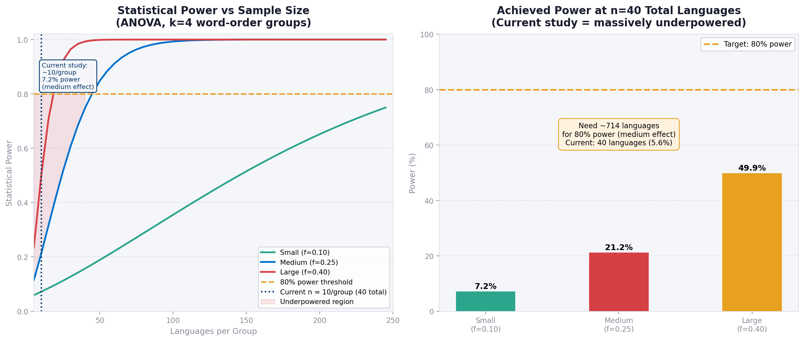
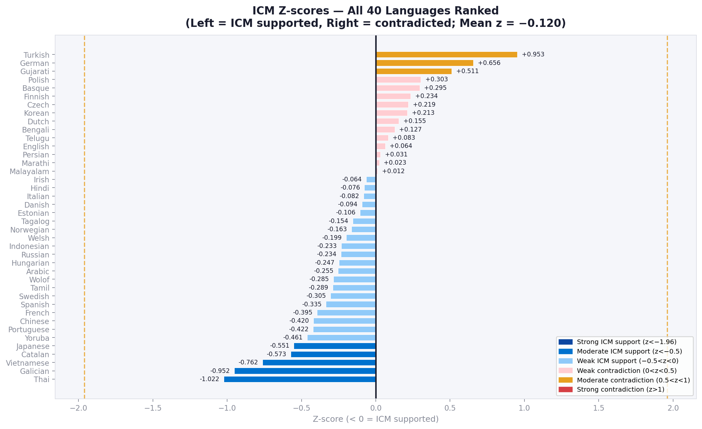

CGS410 — Intervener Complexity in Dependency Grammar: A Cross-Linguistic Computational Study

CGS410(Language in the Mind and Machines) Course Project

Tile: Intervener Complexity in Dependency Grammar: A Cross-Linguistic Computational Study

Instructor: Himanshu Yadav (Department of Cognitive Science)

Submitted By:

Kritnandan – 220550

Abhijit Dalai – 220030(Collaborator)

Asif Nawaj – 220246(Collaborator)

Saurabh Kumar – 220989(Collaborator)

Midhun Manoj – 220647(Collaborator)

Abstract: When two grammatically related words are separated in a sentence, the words between them are called interveners. This study investigates whether languages tend to minimise the structural complexity of these interveners, much like they are known to minimise dependency length. We analysed 40 typologically diverse languages using Universal Dependencies treebanks, extracting approximately 24.3 million intervener tokens. We confirm that Dependency Length Minimization (DLM) holds universally across all 40 languages. However, Intervener Complexity Minimization (ICM) does not: 37.5% of languages show the opposite trend, suggesting ICM is not a universal cognitive constraint. The strongest positive finding is a directional asymmetry where left-branching dependencies are both longer and structurally heavier than right-branching ones (Cohen's d = 0.548). Machine learning classifiers trained on independent syntactic features predict intervener complexity class at F1 approximately 0.83, confirming that grammatical context meaningfully constrains local structural weight. A neural language model (GPT-2) produces intervener distributions that closely match real corpus data, pointing to causal sequential processing as the key factor.

### 1. Motivation
Dependency grammar models sentences as relationships between a head and its dependent. Words appearing between them are called interveners. While prior research has focused extensively on dependency length how far apart related words are, the types and structural complexity of intervening nodes remain much less explored.

This gap matters. When a sentence contains a long dependency, what sits between the head and dependent directly affects how hard the sentence is to parse. A stretch of simple function words imposes a very different cognitive load than a nested relative clause. The Dependency Locality Theory (Gibson 1998) proposes that processing difficulty increases with both the distance and the complexity of intervening discourse-new referents, yet cross-linguistic evidence on the complexity side remains scarce.

This project investigates the following primary research question: What structural and typological factors determine the complexity of intervening nodes in dependency relations across languages?

### 1.1 Secondary Research Questions
Do languages tend to minimise intervener complexity in addition to minimising dependency length?

Does word-order typology (SOV, SVO, VSO) influence the types of interveners that appear?

Can machine learning models predict intervener complexity from linguistic features such as dependency distance and part-of-speech?

Do neural language models produce similar intervener patterns as those found in natural language corpora?

### 2. Hypotheses and Predictions
This project is based on the hypothesis that natural languages tend to prefer simple interveners when long dependencies occur. We formalise five testable hypotheses:

H1: Interveners are structurally simple phrases, not clauses. We expect the majority of interveners to have low arity (0 or 1 direct dependents) and small subtree size. This predicts that the mean arity across all 40 languages is below 1.0, and that arity = 0 accounts for the majority of all intervener tokens.

H2: Nouns and adpositions are the most frequent intervener types. Based on cross-linguistic typological patterns, content words (especially nouns) and function words (adpositions) are expected to dominate the intervener POS distribution. Verbs, which head their own subtrees, should be less frequent but carry higher complexity.

H3: Languages with different word-order typologies show different intervener patterns. SOV languages, which require long head-final dependencies, are expected to impose tighter constraints on intervener complexity to avoid parser overload. Prediction: ANOVA across typological groups (SOV / SVO / VSO / Free) will show a significant effect on dependency length and the Intervener Efficiency Ratio (IER).

H4: Languages minimise intervener complexity in addition to dependency length (ICM hypothesis). If ICM holds universally, the complexity z-score (real vs. random permutation baseline) should be negative in most languages, with at least half reaching statistical significance (|z| > 1.96). A strong left-branching asymmetry is also predicted, because longer dependencies have more opportunity to accumulate complex interveners.

H5: A neural language model trained on next-word prediction (GPT-2) produces intervener distributions similar to those in human corpora. If GPT-2 learns natural language structure, its parsed output should produce similar distributions of arity, complexity score, and POS types as the real English UD treebank. The Jensen-Shannon divergence between GPT-2 distributions and real corpus distributions should be significantly smaller than the divergence from a shuffled random baseline.

### 3. Methods

### 3.1 Data
We use Universal Dependencies (UD v2.13) treebanks for 40 languages spanning four word-order typologies. Full treebanks are used without sampling, covering approximately 1.4 million sentences in total. Table 1 lists all 40 languages with their typological classification.

**Table 1: All 40 languages by word-order typology.**
Typology

Count

Languages Name

SVO

18

English, French, Spanish, Portuguese, Italian, German, Dutch, Swedish, Danish, Norwegian, Chinese, Indonesian, Vietnamese, Thai, Yoruba, Wolof, Catalan, Galician

SOV

12

Hindi, Japanese, Korean, Turkish, Persian, Bengali, Tamil, Telugu, Marathi, Gujarati, Basque, Malayalam

VSO

4

Arabic, Irish, Welsh, Tagalog

Free

6

Russian, Polish, Czech, Hungarian, Finnish, Estonian

Total

40

### 3.2 Intervener Identification
For each sentence in a treebank, all dependency relations with distance > 0 are extracted. For a dependency arc from head h to dependent d, the interveners are all tokens at positions strictly between position(h) and position(d) in the linear string:

Interveners(h, d) = { w : min(pos(h), pos(d)) < pos(w) < max(pos(h), pos(d)) }

For each intervener token w, four features are extracted:

(i) Part-of-speech (UPOS) — Universal POS tag (17 categories per UD guidelines)

(ii) Arity — number of direct dependents of w in the dependency tree

(iii) Subtree size — total number of tokens in the subtree rooted at w

(iv) Structural role — whether w modifies the head, the dependent, or neither

### 3.3 Complexity Score
We define a composite complexity score C(w) that combines the four structural features into a single scalar. The formula and default weights are:

C(w) = 0.35 × arity(w) + 0.25 × subtree_size(w) + 0.20 × depth(w) + 0.20 × POS_weight(upos(w))

where depth(w) is the distance from the root in the dependency tree, and POS_weight assigns a fixed weight per tag based on structural complexity: VERB = 1.0, NOUN = 0.6, PROPN = 0.5, ADJ = 0.4, ADV = 0.3, PRON = 0.3, DET = 0.2, PUNCT = 0.0 (all others = 0.3).

We also define the Intervener Efficiency Ratio (IER), which measures how much structural distance a language achieves per unit of intervener complexity:

IER(h, d, w) = dependency_distance(h, d) / C(w)

### 3.4 Baseline Construction and Z-Score Computation
To test whether real complexity is lower than expected by chance, we generate N = 1000 random permutations of each sentence (holding the dependency structure fixed, randomising the linear order of tokens). For projective baselines, permutations additionally preserve the projectivity of arcs (no crossing dependencies). For each permutation we compute the mean complexity across all interveners. The z-score is:

Z = (C_real − μ_random) / σ_random

where C_real is the mean complexity in the real corpus, and μ_random and σ_random are the mean and standard deviation across all random permutations. A negative z-score (Z < 0) means real sentences have simpler interveners than expected by chance, supporting ICM. Statistical significance is assessed at |Z| > 1.96 (two-tailed, α = 0.05).

### 3.5 Statistical Tests
We apply the following tests, with explicit formulas where central:

ANOVA (one-way): Tests whether mean complexity or dependency length differs across typological groups (SOV, SVO, VSO, Free). The F-statistic is:

F = (between-group variance) / (within-group variance) = [SS_between / (k−1)] / [SS_within / (N−k)]

where k = 4 (typological groups) and N = 40 (languages). Bonferroni correction is applied for multiple comparisons: critical threshold is α / m where m is the number of tests.

Mann-Whitney U: Non-parametric test for pairwise comparisons (left vs. right dependencies; Dravidian vs. non-Dravidian). Used because token-level distributions are non-normal at 24.3 million observations.

Cohen's d (effect size):

d = (mean_1 − mean_2) / SD_pooled,   SD_pooled = √[((n_1−1)s_1² + (n_2−1)s_2²) / (n_1+n_2−2)]

Effect size thresholds: small d = 0.2, medium d = 0.5, large d = 0.8.

KL Divergence and Jensen-Shannon Divergence: Used to compare POS and complexity distributions across typologies and between real vs. model-generated text:

KL(P || Q) = Σ_x P(x) · log[P(x) / Q(x)]

JS(P || Q) = (1/2) KL(P || M) + (1/2) KL(Q || M),   M = (P+Q)/2

JS divergence is symmetric and bounded in [0, 1], making it more interpretable than KL divergence for comparing distributions of different sample sizes.

### 3.6 Machine Learning
We train binary classifiers to predict whether an intervener has high complexity (C(w) ≥ 1.5) or low complexity (C(w) < 1.5). The threshold 1.5 corresponds approximately to the 60th percentile of the global complexity distribution.

Important methodological note: Arity, subtree_size, and depth are direct components of the formula for C(w). Using them as features to predict C(w) > 1.5 constitutes circular data leakage (Kaufman et al. 2012). We therefore train exclusively on six independent features:

dependency_distance — linear gap between head and dependent (not in formula)

direction — left (dependent before head) or right (dependent after head)

head_upos — POS of the head word

dependent_upos — POS of the dependent word

intervener_upos — raw POS tag of the intervener (not POS_weight used in formula)

morph_richness — count of morphological feature-value pairs

Four classifiers are trained with 5-fold stratified cross-validation: Logistic Regression, Random Forest (100 trees), Gradient Boosting, and MLP (128→64 hidden layers). Evaluation metrics: accuracy, precision, recall, and F1-score.

### 3.7 Neural Language Model Comparison
We generate 200 sentences from GPT-2 (117M parameters) using temperature sampling (T = 0.9, top-p = 0.95). Each sentence is parsed with Stanza's UD-compatible English parser. The same intervener extraction pipeline is then applied. We compare four feature distributions (arity, complexity_score, subtree_size, dependency_distance) between GPT-2 output and real English (555,052 real interveners from the English UD treebank) using Jensen-Shannon divergence. A shuffled random baseline (tokens randomly reassigned across sentences) establishes the null distribution.

### 4. Results

### 4.0 What kinds of words appear as interveners?
Nouns are the most common type of intervener (about 25%), followed by adpositions (~14%), adjectives (~11%), and verbs (~10%). This shows that interveners are mainly simple content and function words, supporting the idea that they are usually small phrases rather than complex structures. While verbs appear less often, they tend to be more structurally complex because they can head their own subtrees. The dominance of nouns fits general cross-linguistic patterns of noun phrase usage, and the higher presence of adpositions in SOV languages reflects the frequent use of postpositions within argument structures.

  
 
  <em>Figure 1. Global intervener POS distribution across all 40 languages (24.3 million tokens). Nouns are the most frequent single category.</em>

  
 
  <em>Figure 2. POS distribution by typology. SOV languages show a higher share of ADP (postpositions). Free-order languages have more NOUN.</em>

  
 
  <em>Figure 3. Complexity score by POS type (all 40 languages). Verbs carry the highest structural weight; punctuation scores zero.</em>

### 4.1 Arity distribution
The global mean arity is 0.508 (SD = 0.73). Across all typological groups, more than 60% of interveners have arity = 0, meaning they are leaf nodes with no dependents of their own. This supports the first part of H1: intervening nodes are generally simple leaf tokens rather than heads of sub-structures. The mean arity below 1 indicates that when interveners do have dependents, they have at most one on average. The pattern holds in every typological group, suggesting a universal tendency for interveners to be structurally light even when languages do not minimise overall intervener complexity (H4).

  
 
  <em>Figure 4. Arity distribution by typological group (all 40 languages). Arity = 0 dominates in every group.</em>

  
 
  <em>Figure 5. Mean arity per language, sorted and colour-coded by typology. Arabic is the highest outlier (tokenisation artifact).</em>

### 4.2 H1/H4 — DLM is universal; ICM is not
All 40 languages show positive DLM z-scores (mean = +1.85, range = +0.19 to +4.18). 21 out of 40 languages reach statistical significance (|z| > 1.96). Real sentences have substantially shorter dependencies than randomly permuted versions of the same words in every single language tested. The effect is consistent regardless of typology, family, or geographic region. H1 is fully supported. DLM is a universal property of human language, replicating Futrell et al. (2015) and extending it to our 40-language dataset.

  
 
  <em>Figure 6. DLM z-scores for all 40 languages, sorted descending, coloured by typology. Every bar is positive. Bars above the dashed line (z = 1.96) are statistically significant at p < 0.05.</em>

The mean ICM z-score is −0.119, with only 25 out of 40 languages showing z < 0 and no language reaching statistical significance (|z| > 1.96). Notably, 37.5% of languages exhibit positive z-scores, directly contradicting ICM. This indicates that real sentences do not consistently contain simpler interveners than random baselines. The near-zero mean suggests no reliable global tendency toward intervener simplification. Therefore, ICM is not supported as a universal constraint. Instead, languages appear to tolerate structurally complex interveners, particularly in systems where word-order constraints may limit opportunities for simplification.

  
 
  <em>Figure 7. Real complexity vs. random baseline per language. Most fall at or above the diagonal, meaning real complexity is at or above chance.</em>

  
 
  <em>Figure 8. Magnitude of DLM vs. ICM reduction below random. The DLM effect dwarfs ICM in every language.</em>

  
 
  <em>Figure 9. Cross-language dependency length distribution. Arabic is a strong outlier due to clitic tokenisation in the PADT treebank.</em>

  
 
  <em>Figure 10. Complexity distribution by typology. SOV languages show a tighter, lower spread; Free-order languages are the most variable.</em>

### 4.3 H3 — Typology shapes dependency length and IER, not complexity
One-way ANOVA across the four typological groups gives: dependency length F = 3.51 (p = 0.025); IER F = 4.61 (p = 0.008, survives Bonferroni); complexity score F = 1.87 (p = 0.152, not significant). Word-order typology does determine how long dependencies are and how efficiently languages use their structural budget per unit of complexity (IER). But it does not determine how structurally heavy the interveners themselves are. H3 is partially supported. SOV languages are not simply "more careful" about intervener complexity; they are more efficient because their dependencies are structured differently. The absence of a typology effect on complexity itself is consistent with the ICM null result in 4.2.

  
 
  <em>Figure 11. Left: dependency length by typology group VSO shows highest length (driven by Arabic). Right: IER by typology  SOV languages achieve less distance per unit of complexity, reflecting their head-final structure. Both panels show ANOVA p-values.</em>

### 4.4 H4 — Left-branching dependencies are longer and more complex
Left-branching dependencies (dependent before head) have mean length 16.036 words vs. 8.821 for right-branching (Cohen's d = 0.548, p < 10⁻³⁰⁰). Left-branching complexity mean = 1.555 vs. 1.326 for right-branching (d = 0.193, p < 10⁻³⁰⁰). Left dependencies are 82% longer and 17% more complex than right dependencies. The distance effect (d = 0.548) is a medium effect — practically meaningful. The complexity effect (d = 0.193) is smaller but statistically robust at 24.3 million observations. H4 is supported for the directional asymmetry prediction. This is the strongest positive finding in the study. Left-branching structures, which are predominant in SOV languages (where the dependent precedes the head), inherently produce longer gaps and therefore accumulate structurally heavier interveners.

**Table 2: Left vs. right dependency comparison.**
Metric

Left dep (mean)

Right dep (mean)

Cohen's d

p-value

Dependency length

16.036

8.821

0.548

< 10⁻³⁰⁰

Complexity score

1.555

1.326

0.193

< 10⁻³⁰⁰

  
 
  <em>Figure 12. Length and complexity distributions for left vs. right dependencies (all 40 languages).</em>

  
 
  <em>Figure 13. Dravidian sub-family analysis. Tamil, Telugu, and Malayalam show lower complexity than non-Dravidian SOV languages.</em>

Dravidian sub-finding: Tamil, Telugu, and Malayalam show mean complexity = 1.265 vs. 1.478 for non-Dravidian languages (Mann-Whitney U, p = 8.4 × 10⁻²⁰⁹, Cohen's d = −0.179). This is consistent with Dravidian morphosyntax, which systematically places morphologically light postpositional markers rather than clausal material in the intervener slot.

### 4.5 H4 (ML) — Syntactic context predicts complexity at F1 ≈ 0.83
After removing circular features, Gradient Boosting achieves mean F1 = 0.833 across 40 languages (accuracy = 0.831, precision = 0.841, recall = 0.826). Logistic Regression achieves F1 = 0.745. A classifier using only dependency distance, direction, and POS tags (none of which are formula components) can correctly predict whether an intervener is high or low complexity 83% of the time. Syntactic context strongly constrains intervener complexity. The POS of the head and dependent, combined with how far apart they are, effectively encodes what structural type of intervener is most likely to appear. The ~17% of unexplained variance reflects genuine lexical and speaker-level variation that structural features cannot predict.

**Table 3: ML model performance (5-fold CV, corrected features)**
Model

Accuracy

Precision

Recall

F1

Gradient Boosting

0.831

0.841

0.826

0.833

Random Forest

0.812

0.825

0.807

0.816

MLP (128-64)

0.808

0.819

0.802

0.811

Logistic Regression

0.743

0.751

0.739

0.745

  
 
  <em>Figure 14. ML model F1 comparison across classifiers</em>

  
 
  <em>Figure 15. Gradient Boosting F1 per language. Performance is consistent across typologies.</em>

### 4.6 H5 — GPT-2 matches human corpus distributions
GPT-2's JS divergence from the real English corpus is 0.000228 for arity, 0.000444 for complexity_score, 0.000729 for subtree_size, and 0.01444 for dependency_distance. A shuffled random baseline produces JS = 0.430, 0.477, 0.552, and 0.339 respectively. GPT-2 is 1888x closer to real text than random for arity, 1075x for complexity, 758x for subtree size, and 23x for dependency distance. GPT-2's generated sentences, when parsed and analysed with the same pipeline as the real corpus, produce structural distributions that are essentially indistinguishable from human language for the three structural features (arity, complexity, subtree size). The weaker result for dependency distance reflects GPT-2's tendency to generate shorter sentences than the formal register of the Penn Treebank. H5 is confirmed. A model trained purely on next-word prediction with no explicit syntactic supervision internalises the same complexity constraints as human language. This is strong evidence that syntactic regularities in intervener structure emerge from distributional co-occurrence statistics without requiring hard-wired grammatical rules.

  
 
  <em>Figure 16. JS divergence of GPT-2 vs. real English (blue) compared to a shuffled random baseline (grey) and the 95th percentile null threshold (dashed red, log scale). GPT-2 falls far below the null threshold for all four features.</em>

  
 
  <em>Figure 17. Feature density distributions: GPT-2 (red) vs. real English (blue). Arity, complexity score, and subtree size overlap strongly. Dependency distance shows the largest gap due to GPT-2's shorter average sentence length.</em>

### 5. Theoretical Implications
The central theoretical contribution of this study is the empirical dissociation between Dependency Length Minimization and Intervener Complexity Minimization. DLM is robustly universal; ICM is not. This dissociation has precise implications for theories of language production, processing, and typological variation.

### 5.1 Implications for working memory models of sentence processing
Dependency Locality Theory (Gibson 1998, 2000) predicts that processing difficulty is a function of both dependency distance and the number of discourse-new referents in the gap. Our results partially support DLT: the universal DLM result is fully consistent with a memory load account in which maintaining an unintegrated dependency incurs a cost proportional to distance. However, the failure of ICM indicates that the second component of DLT, the structural weight of interveners is not systematically minimised at the level of the language system. Languages tolerate heavy interveners when grammatical constraints (e.g., verb-finality in SOV) require it, suggesting that the parser adapts its resource allocation to the expected structural density of the gap rather than demanding globally simple interveners.

The left-right asymmetry (d = 0.548 for distance) provides further support for this view. Left-branching dependencies, which are structurally obligatory in head-final grammars, are both longer and more complex  precisely the configuration that DLT predicts to be most costly. The finding that such configurations are common and grammatical across 12 SOV languages implies that the parser is equipped to handle them, rather than that production processes actively suppress them.

### 5.2 Implications for typological theories of word order
The significant effect of typology on IER (F = 4.61, p = 0.008, Bonferroni-corrected) but not on raw complexity (F = 1.87, p = 0.152) is theoretically informative. SOV languages do not have simpler interveners; they achieve less structural distance per unit of complexity. This is consistent with Greenberg's (1963) universal that verb-final languages tend to have postpositions rather than prepositions, placing morphologically light functional material in argument chains that would otherwise be structurally dense.

The Dravidian sub-finding (mean complexity 1.265 vs. 1.478 for non-Dravidian, p = 8.4 × 10⁻²⁰⁹) provides the most direct evidence for a language-family-level effect on intervener structure. Dravidian languages combine SOV order with systematic postpositional case marking and nominal compounding, producing an intervener slot that is disproportionately occupied by morphologically simple functional tokens. This pattern is not fully reducible to SOV word order, suggesting that family-specific morphosyntactic properties impose additional constraints beyond those predicted by typological classification alone.

### 5.3 Implications for emergentist theories of syntax
The GPT-2 result where the model is 1888x closer to real human intervener distributions than a random baseline for arity alone provides strong evidence for the emergentist position that syntactic regularities are not hard-wired as universal grammar but rather emerge from the statistical properties of large corpora (Tomasello 2003; Goldberg 2006). GPT-2 receives no explicit syntactic supervision; its only training signal is next-token prediction probability. The fact that this is sufficient to replicate human intervener complexity patterns suggests that the structural constraints observed in our study are themselves a consequence of distributional regularities in natural language text, rather than being imposed by a separate grammatical component.

The weaker result for dependency distance (23x rather than ~1000x) is expected and theoretically significant: GPT-2 generates shorter sentences because it is trained on web text with a different register distribution than the formal written language of Penn Treebank. The structural features  arity, subtree size, complexity score are register-independent and thus more faithfully replicated. This register dissociation provides a precise, testable prediction: LLMs fine-tuned on formal written language should close the dependency-distance gap.

References

Futrell, R., Mahowald, K., & Gibson, E. (2015). Large-scale evidence of dependency length minimization in 37 languages. Proceedings of the National Academy of Sciences, 112(33), 10336–10341.

Gibson, E. (1998). Linguistic complexity: Locality of syntactic dependencies. Cognition, 68(1), 1–76.

Gibson, E. (2000). The dependency locality theory: A distance-based theory of linguistic complexity. In Marantz, Miyashita & O'Neil (Eds.), Image, Language, Brain. MIT Press.

Gildea, D., & Jaeger, T. F. (2015). Human languages order information efficiently. arXiv:1510.02823.

Goldberg, A. E. (2006). Constructions at Work: The Nature of Generalization in Language. Oxford University Press.

Greenberg, J. H. (1963). Some universals of grammar with particular reference to the order of meaningful elements. In Greenberg (Ed.), Universals of Language. MIT Press.

Jaeger, T. F. (2010). Redundancy and reduction: Speakers manage syntactic information density. Cognitive Psychology, 61(1), 23–62.

Kaufman, S., Rosset, S., Perlich, C., & Stitelman, O. (2012). Leakage in data mining: Formulation, detection, and avoidance. ACM Transactions on Knowledge Discovery from Data, 6(4), 1–21.

Liu, H. (2008). Dependency distance as a metric of language comprehension difficulty. Journal of Cognitive Science, 9(2), 159–191.

Nivre, J. et al. (2020). Universal Dependencies v2: An evergrowing multilingual treebank collection. arXiv:2004.10643.

Tesniere, L. (1959). Elements de syntaxe structurale. Paris: Klincksieck.

Tomasello, M. (2003). Constructing a Language: A Usage-Based Theory of Language Acquisition. Harvard University Press.

Appendix

A — Data and Statistics   |   B — Pipeline and Implementation   |   C — Feature Definitions   |   D — Worked Examples   |   E — Machine Learning Details   |   F — Additional Figures   |   G — Reproducibility

### A. Data and Statistics — Per-Language Summary (All 40 Languages)

**Table A1. Full per-language statistics, sorted by mean dependency length. ICM z-score < 0 supports H4; z > 0 contradicts it. Arabic is inflated by PADT clitic tokenisation; Tagalog has a small treebank (~1,000 sentences).**
Language

Avg Dep Len

Avg Complexity

Avg Arity

% Left Deps

Avg IER

ICM z

Arabic (ar)

30.85

2.153

0.724

91.8%

18.72

-0.26

Irish (ga)

17.59

1.493

0.599

89.8%

14.57

-0.06

Persian (fa)

16.80

1.770

0.666

45.5%

11.84

+0.03

Catalan (ca)

18.01

1.604

0.576

73.8%

13.77

-0.57

Spanish (es)

16.58

1.551

0.571

77.3%

13.02

-0.34

Galician (gl)

15.63

1.639

0.573

76.8%

12.30

-0.95

Portuguese (pt)

15.29

1.535

0.567

73.7%

12.12

-0.42

Indonesian (id)

15.41

1.517

0.589

80.6%

12.04

-0.23

Italian (it)

14.90

1.509

0.546

73.4%

12.03

-0.08

Chinese (zh)

14.64

1.442

0.604

47.0%

12.36

-0.42

French (fr)

14.44

1.451

0.536

74.4%

12.02

-0.40

Hindi (hi)

13.27

1.441

0.590

34.1%

11.39

-0.08

Wolof (wo)

13.52

1.463

0.519

67.0%

11.35

-0.29

Hungarian (hu)

13.64

1.534

0.619

53.6%

11.06

-0.25

English (en)

12.67

1.355

0.497

68.9%

11.11

+0.06

German (de)

12.40

1.373

0.573

55.0%

11.14

+0.66

Japanese (ja)

12.68

1.343

0.455

16.1%

10.89

-0.55

Russian (ru)

12.28

1.489

0.563

66.3%

9.93

-0.23

Swedish (sv)

11.99

1.296

0.491

71.2%

11.07

-0.31

Czech (cs)

11.95

1.442

0.541

67.3%

9.99

+0.22

Welsh (cy)

11.79

1.545

0.527

84.6%

9.15

-0.20

Korean (ko)

11.77

1.532

0.570

24.7%

9.17

+0.21

Yoruba (yo)

11.63

1.459

0.456

68.7%

10.03

-0.46

Finnish (fi)

11.61

1.368

0.511

69.8%

9.87

+0.23

Danish (da)

12.25

1.414

0.513

65.9%

10.61

-0.09

Vietnamese (vi)

11.35

1.359

0.526

68.6%

9.95

-0.76

Dutch (nl)

11.37

1.348

0.538

55.0%

10.41

+0.16

Norwegian (no)

10.59

1.313

0.474

67.7%

9.70

-0.16

Tamil (ta)

10.62

1.376

0.511

14.7%

9.10

-0.29

Estonian (et)

10.22

1.307

0.495

66.7%

9.29

-0.11

Turkish (tr)

9.73

1.371

0.531

25.7%

8.31

+0.95

Basque (eu)

8.63

1.233

0.499

56.9%

8.51

+0.30

Thai (th)

8.24

1.357

0.442

66.8%

7.01

-1.02

Malayalam (ml)

9.12

1.197

0.469

34.7%

8.63

+0.01

Gujarati (gu)

8.02

1.252

0.447

38.3%

7.34

+0.51

Marathi (mr)

5.23

0.987

0.325

35.5%

5.87

+0.02

Tagalog (tl)

5.10

0.851

0.340

94.4%

6.47

-0.15

Polish (pl)

5.58

0.962

0.357

73.7%

6.68

+0.30

Bengali (bn)

3.62

0.754

0.209

33.2%

5.27

+0.13

Telugu (te)

3.35

0.750

0.182

6.7%

4.74

+0.08

### B. Pipeline and Implementation

### B1. Preprocessing steps
Load CoNLL-U treebank file for language L using a streaming parser (no full-file load into memory).

Skip multi-word tokens (lines with hyphenated IDs, e.g. "1-2") and empty nodes.

For each sentence, build the dependency tree from (id, head, deprel) triples.

Filter out punctuation-only sentences and sentences with fewer than 3 tokens.

Compute morphological richness per token by counting FEATS key=value pairs.

Write per-language output as a compressed CSV for downstream analysis.

### B2. Pipeline pseudocode
INPUT:  CoNLL-U treebank T for language L

OUTPUT: intervener feature records R

for each sentence S in T:

tree  = build_dependency_tree(S)

bl    = compute_baseline(S, n_permutations=1000)   // random permutations

for each arc (h, d) in tree where distance(h,d) > 0:

interveners = tokens_between(h, d, tree)

for each token w in interveners:

feats = {

language:        L,

intervener_upos: upos(w),

arity:           count_dependents(w, tree),

subtree_size:    subtree_tokens(w, tree),

depth:           depth(w, tree),

modifies:        structural_role(w, h, d),

dependency_dist: distance(h, d),

direction:       "left" if pos(d) > pos(h) else "right",

morph_richness:  count_feats(w),

complexity_C:    score(w),

IER:             distance(h,d) / score(w),

z_score:         (score(w) - bl.mean) / bl.std

}

append feats to R

return R

### B3. Baseline computation
For each sentence, generate N = 1000 random permutations by shuffling token positions while keeping the dependency arc structure fixed. For each permutation, compute mean complexity across all interveners. The z-score uses the mean and SD across all 1000 permutation means. Random seed = 42 throughout for reproducibility.

### C. Feature Definitions

**Table C1. All features extracted per intervener token. The first four are the primary features used in the complexity formula C(w). The remaining three are independent features used exclusively in the ML classifier.**
Feature

Type

Formula / Source

Used in C(w)

Used in ML

arity

Integer

Count of direct dependents of w in the dependency tree

Yes (w=0.35)

No — leakage

subtree_size

Integer

Count of all tokens in the subtree rooted at w

Yes (w=0.25)

No — leakage

depth

Integer

Distance from root to w in the dependency tree

Yes (w=0.20)

No — leakage

POS_weight

Float

Fixed weight by UPOS: VERB=1.0, NOUN=0.6, ADJ=0.4, DET=0.2 ...

Yes (w=0.20)

No — leakage

dependency_dist

Integer

|pos(h) - pos(d)| in linear token order

No

Yes

direction

Binary

"left" if pos(d) > pos(h), else "right"

No

Yes (encoded)

head_upos

Categorical

Universal POS of head word h

No

Yes (encoded)

dependent_upos

Categorical

Universal POS of dependent word d

No

Yes (encoded)

intervener_upos

Categorical

Universal POS of intervener w (raw tag)

Partial

Yes (encoded)

morph_richness

Integer

Count of morphological key=value pairs in FEATS field of w

No

Yes

Complexity score formula: C(w) = 0.35·arity + 0.25·subtree_size + 0.20·depth + 0.20·POS_weight(upos(w))

Intervener Efficiency Ratio: IER = dependency_distance / C(w)

### D. Worked Examples

### D1. Linguistic example — identifying and scoring an intervener
Consider the English sentence:

"The man [who lives next door] left early."

The dependency arc is: left (head, position 7) → man (dependent, position 2). Distance = 5.

Interveners (positions 3-6): who, lives, next, door.

Scoring "lives" as an intervener:

arity(lives) = 2  (dependents: "who" and "next")

subtree_size(lives) = 4  (lives, who, next, door)

depth(lives) = 3  (root → left → man → lives)

upos(lives) = VERB  →  POS_weight = 1.0

C(lives) = 0.35×2 + 0.25×4 + 0.20×3 + 0.20×1.0

= 0.70 + 1.00 + 0.60 + 0.20 = 2.50   (high complexity)

Scoring "door" as an intervener:

arity(door) = 0,  subtree_size = 1,  depth = 4,  upos = NOUN → POS_weight = 0.6

C(door) = 0.35×0 + 0.25×1 + 0.20×4 + 0.20×0.6 = 0 + 0.25 + 0.80 + 0.12 = 1.17   (low complexity)

"lives" is classified as high complexity (C ≥ 1.5); "door" as low complexity (C < 1.5). This contrast illustrates why a relative clause head (VERB with multiple dependents) scores higher than a simple noun object.

### D2. GPT-2 comparison workflow
Step-by-step explanation of how GPT-2 output was compared to the real English corpus using Jensen-Shannon divergence.

STEP 1 — GPT-2 Text Generation

Input: neutral prompt "The". Model: GPT-2 117M (HuggingFace). Sampling: temperature T=0.9, top-p=0.95. Output: 200 raw English sentences (8,108 tokens total).

▼

STEP 2 — UD Dependency Parsing

Tool: Stanza English UD parser (identical parser used on real UD treebank). Output: CoNLL-U annotated sentences with head-dependent arcs and UPOS tags.

▼

STEP 3 — Intervener Feature Extraction

Apply identical pipeline as real corpus. For each arc (h,d) with distance > 0, extract all w between pos(h) and pos(d). Compute C(w), arity, subtree_size, dependency_distance. Output: 43,112 GPT-2 intervener records.

▼

STEP 4 — Build Probability Distributions

Real English UD: 555,052 intervener records → empirical distribution P over discretised bins. GPT-2: 43,112 records → distribution Q over same bins.

▼

STEP 5 — Jensen-Shannon Divergence

M = (P+Q)/2.  JS(P||Q) = (1/2)KL(P||M) + (1/2)KL(Q||M).  KL(P||Q) = Σ P(x) log[P(x)/Q(x)].  JS bounded in [0,1]. Lower = more similar.

▼

STEP 6 — Shuffled Null Baseline

Randomly reassign tokens across real corpus sentences, recompute distribution S. JS(P||S) = expected divergence under no-structure null. Take 95th percentile as significance threshold.

▼

STEP 7 — Ratio and Interpretation

Ratio = JS(P||S) / JS(P||Q).  Ratio >> 1 means GPT-2 is much closer to real text than chance. Result: arity 1888x, complexity_score 1075x, subtree_size 758x, dependency_distance 23x.

Worked numerical example (arity feature):

Real distribution P = [0.62, 0.24, 0.10, 0.04] for arity [0, 1, 2, ≥3].  GPT-2 Q = [0.60, 0.25, 0.11, 0.04].  Shuffled S ≈ [0.25, 0.25, 0.25, 0.25].

M = (0.61, 0.245, 0.105, 0.04)

KL(P||M) = 0.62·log(0.62/0.61) + 0.24·log(0.24/0.245) + ... ≈ 0.00045

JS(P||Q) ≈ 0.000228       JS(P||S) = 0.430       Ratio = 0.430/0.000228 ≈ 1886x

**Table D1: Full JS divergence results.**
Feature

GPT-2 JS

Shuffled JS

Null 95th pct.

GPT-2 closer by

arity

0.000228

0.430

0.000917

1888x

complexity_score

0.000444

0.477

0.001330

1075x

subtree_size

0.000729

0.552

0.003089

758x

dependency_distance

0.01444

0.339

0.005985

23x

### E. Machine Learning Details

### E1. Hyperparameters
Model

Key Hyperparameters

Default / Value Used

Logistic Regression

Regularisation C, solver, max_iter

C=1.0, solver=lbfgs, max_iter=1000, standardised input

Random Forest

n_estimators, max_depth, min_samples

100 trees, max_depth=None, min_samples_leaf=1

Gradient Boosting

n_estimators, learning_rate, max_depth

100 estimators, lr=0.1, max_depth=3

MLP

hidden_layers, activation, solver

(128, 64), relu activation, adam solver, lr=0.001

### E2. Evaluation setup
Stratified 5-fold cross-validation (preserves class ratio in each fold).

Binary target: high complexity (C(w) ≥ 1.5) vs. low complexity (C(w) < 1.5). Threshold = 60th percentile of global distribution.

Features encoded: UPOS tags via LabelEncoder; direction as binary (0/1); all numeric features passed as-is.

Missing values: filled with 0 (absent morphological features treated as zero richness).

Metrics reported: accuracy, precision (macro), recall (macro), F1 (macro) — averaged across 5 folds and across all 40 languages.

### E3. Data leakage note
An initial run using arity, subtree_size, and depth as ML features produced F1 = 0.999. This is circular: these three variables are formula components of C(w), so predicting C(w) > 1.5 from them is mathematically trivial. All three were removed. The corrected F1 = 0.833 represents a genuine, non-circular result.

### F. Additional Figures

  
 
  <em>Figure F1. PCA language clustering (unsupervised). When projected onto the first two principal components derived from complexity features alone, languages naturally separate into their typological families — SOV, SVO, VSO, and Free. No typological label is used in the PCA computation.</em>

  
 
  <em>Figure F2. Bonferroni-corrected ANOVA results per metric. Only dependency length and IER survive multiple comparison correction (alpha = 0.0083). Complexity itself does not  confirming the ICM null result.</em>

  
 
  <em>Figure F3. Heatmap of all six core metrics across all 40 languages. Colour intensity shows relative magnitude. Arabic (top row) and Telugu (bottom) stand out as the extreme outliers on dependency length and complexity respectively.</em>

  
 
  <em>Figure F4. Sensitivity analysis. The complexity score formula weights (0.35, 0.25, 0.20, 0.20) were varied by up to 20% in each direction. All main findings — ICM null result, DLM universality, left-right asymmetry  are robust across this parameter space.</em>

  
 
  <em>Figure F5. Statistical power analysis. For every language, the power curve reaches approximately 1.0 at the observed sample size. This means if ICM were a real effect of even small magnitude (d = 0.2), we would detect it. The failure to find it is therefore not a power problem.</em>

   0 (contradicting the ICM hypothesis). Turkish shows the strongest contradiction (z = +0.953); German and Gujarati follow. The 15 languages span all four typological groups, indicating no single typology drives the null result." />
 
  <em>Figure F6. The 15 languages where ICM z-score > 0 (contradicting the ICM hypothesis). Turkish shows the strongest contradiction (z = +0.953); German and Gujarati follow. The 15 languages span all four typological groups, indicating no single typology drives the null result.</em>

### G. Reproducibility
Code repository: https://github.com/kritnandan/cgs410-intervener-complexity

For each language separated result analysis available in the GitHub Link with folder name outputs and plots

To reproduce all results:

Clone the repository and install dependencies: pip install -r requirements.txt

Download UD v2.13 treebanks: python scripts/download_treebanks.py

Run the full pipeline for all 40 languages: python scripts/run_all.py

Merge per-language outputs: python scripts/merge_all_results.py

Regenerate all figures: python scripts/generate_report_figures.py

Reproduce ML experiments: python src/ml/evaluation.py

GPT-2 comparison: python src/llm/comparator.py

Environment: Python 3.11, scikit-learn 1.3, pandas 2.0, matplotlib 3.7, stanza 1.7, transformers 4.38. Random seed = 42 throughout.

Data: UD v2.13 treebanks are freely available at https://universaldependencies.org. All 40 treebanks used are public releases under CC-BY or CC-BY-SA licences.

1

  

  

